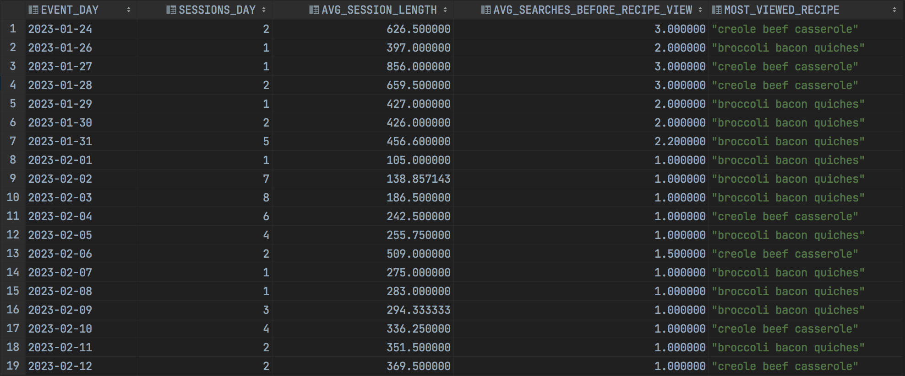
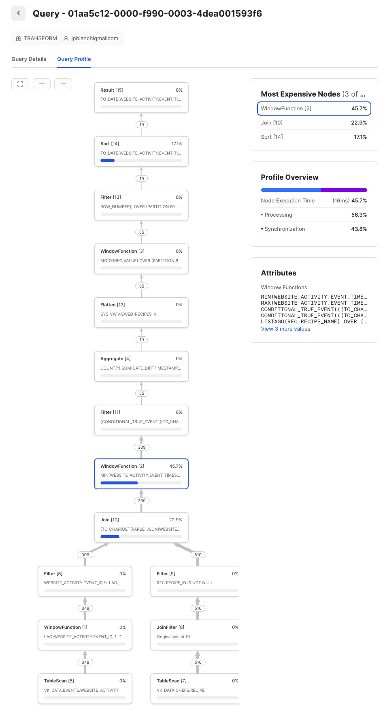
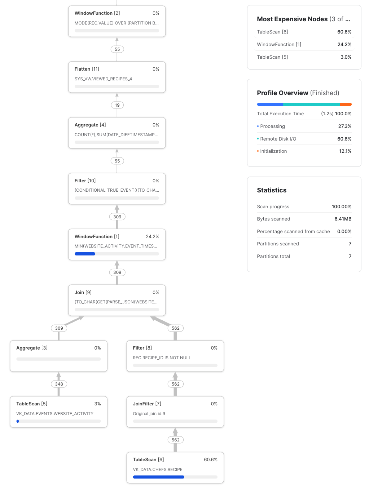

## QUERY PROFILE ANALYSIS:
In CTE "real\_activity1", I tried to remove duplicates using group by, but the query took 1.5s instead of 700ms,
so doing it the way as in 'real\_activity' is faster.  It flags all duplicate rows which are then ignored,
in the join in the next CTE.
I can easily imagine it's faster to go down the session_id and event_id columns than to group by over the whole table.
The memory added with an extra column of booleans is minimal.

From the query profile, we can see (below) that 47% of the time was spent on finding the min and max EVENT_TIMESTAMP for the session times.
The successive window function takes ~ 0%: that's probably because they operate on the same partition, ordered in the same way, so I guess Snowflake saw that and reused the partition.

The join with the RECIPE table to transform the recipe_ids into recipe names is unavoidable, and takes 23%, so I should have done it in the end, when we have the most viewed recipes (1 / day) and a smaller table.
I will fix that for next time, when we have a much bigger table to process.

The 3rd most expensive query is the final sorting by the date, but it is only there for visualization.

## CODE OPTIMIZATION:
I started by removing the duplicate events to decrease the size of the table right off the bat.
Also, in the CTE's, in order to avoid passing a lot of data that will be discarded, I collapse the partition results using 'qualify' rather than passing row_numbers to the next query which then does 'where row = 1'.
Although, I guess a good compiler could do that on its own, not sure.

Next, I did all the partition calculations in one CTE, in order to allow Snowflake to re-use the same partition.  We saw above that the first window function took 47% of the time, and the next one almost zero, so I guess it was a good design choice, over creating several CTE's for clarity (although, again, not sure what a smart compiler can do).

Finally, in preparation for a much bigger activity table, I tried to limit the nb of rows as much as possible.  That's why I stuffed all the recipes per session into a listagg, otherwise, using a classic grouping and counting, we would have had one row per recipe per session.  
This should have a direct impact on joins times.  
I'll take a closer look in P4.

## RESULTS

## QUERY PROFILES

## Query profile by flagging duplicate rows

## Query profile using group by

