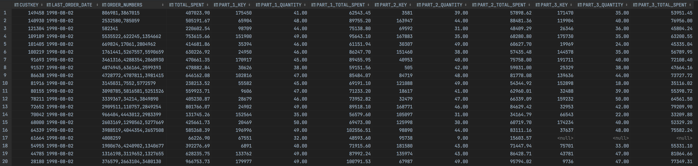
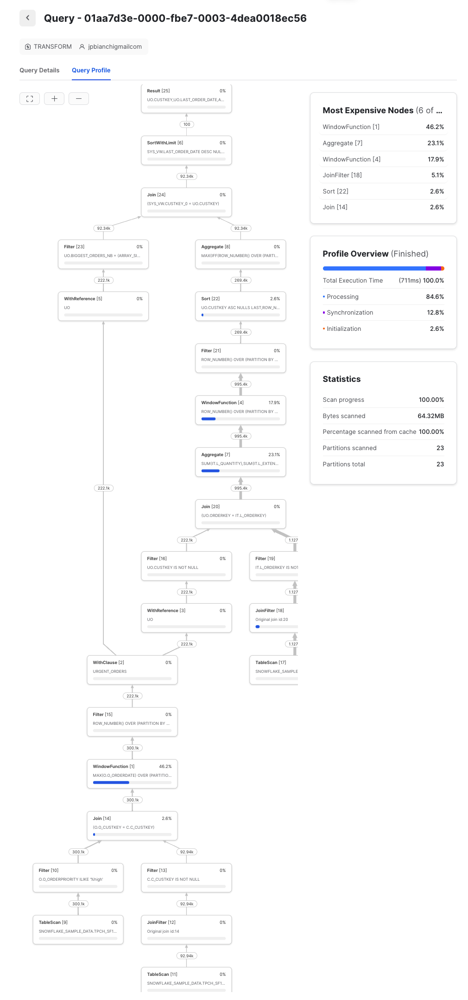
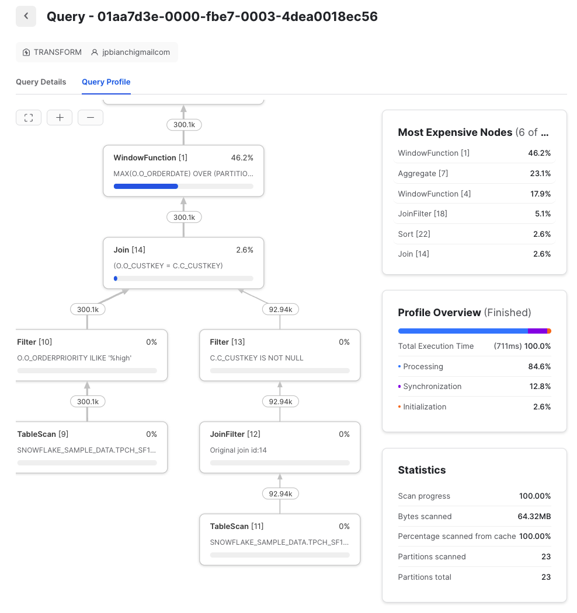
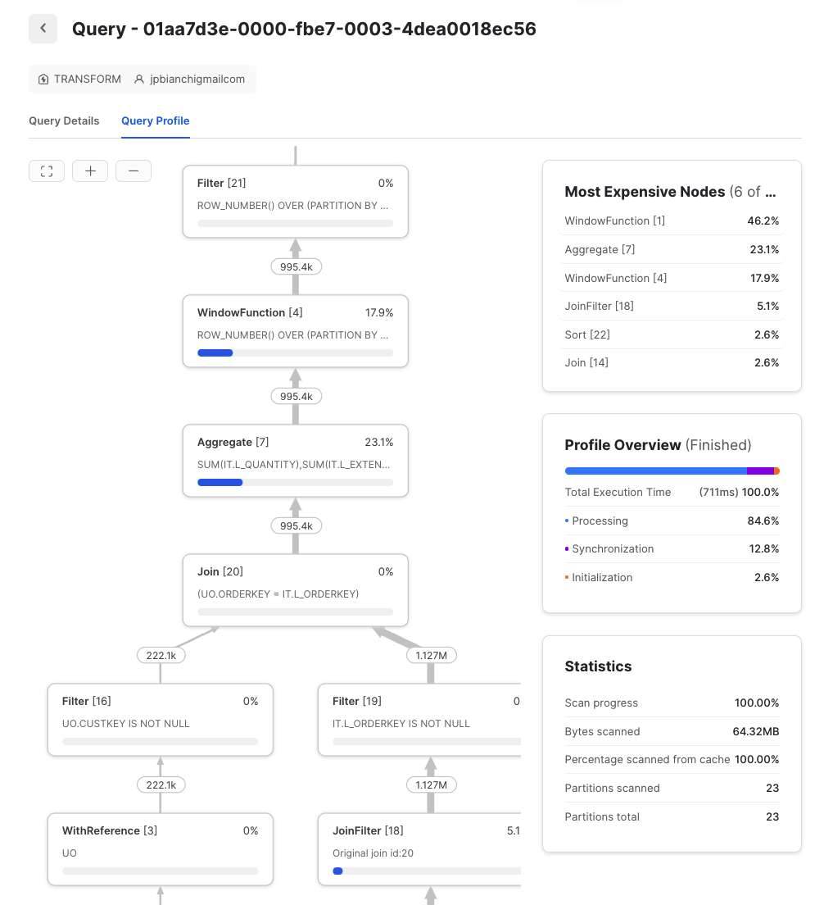

## CRITICS OF CANDIDATE CODE
First of all, there are no comments, so the code is not easy to read.  

The results are wrong.  For instance, the list of the 3 most expensive orders has duplicates.
Also, the window function is ordered using l_extendedprice, which is the price of one item.
It should have been done using O_TOTALPRICE.  

The triple join in the first CTE must be costly since it's done on all elements of each of the 3 tables.
That's why I usually do the utmost possible to reduce the amount of data right off the bat in the first CTE.

Finally, the triple join with urgent_orders to create the data for the first 3 parts is, imo, very costly too.
All that to create columns out of rows.  He should have used pivot instead.
I couldn't make pivot work for some reason, so I created the columns manually.
I'd be happy if someone can show me how to do it with pivot.

## QUERY PROFILE ANALYSIS:
The query profiles shows that, again, the costliest operation is the first window.
The 2nd most expensive one is the sum to calculate the total quantities (no idea why?).
Then, the window function (again) in parts\_prices.

However, all the joins take ~7% cpu time.
I think that is due to the work done with the window functions in the first CTE that reduces the number of rows to the ones we need, and also prepares the list of orders and the total_spent.   
This eases the work of everything else thereafter.

## RESULTS
I think these are the correct results.
The ones given in the project description are obviously wrong since, in the first two lines for instance, an order is repeated twice.
In fact, they seem to come from the candidate's code.  

## QUERY PROFILES

